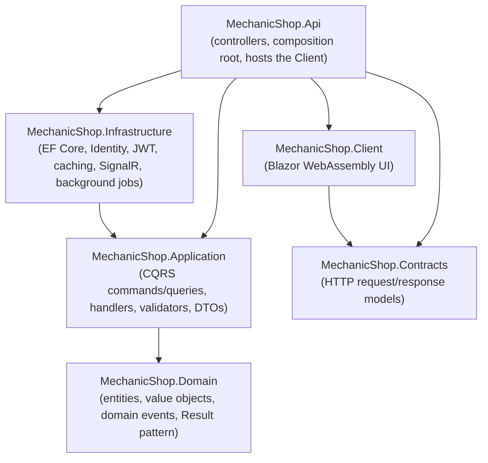
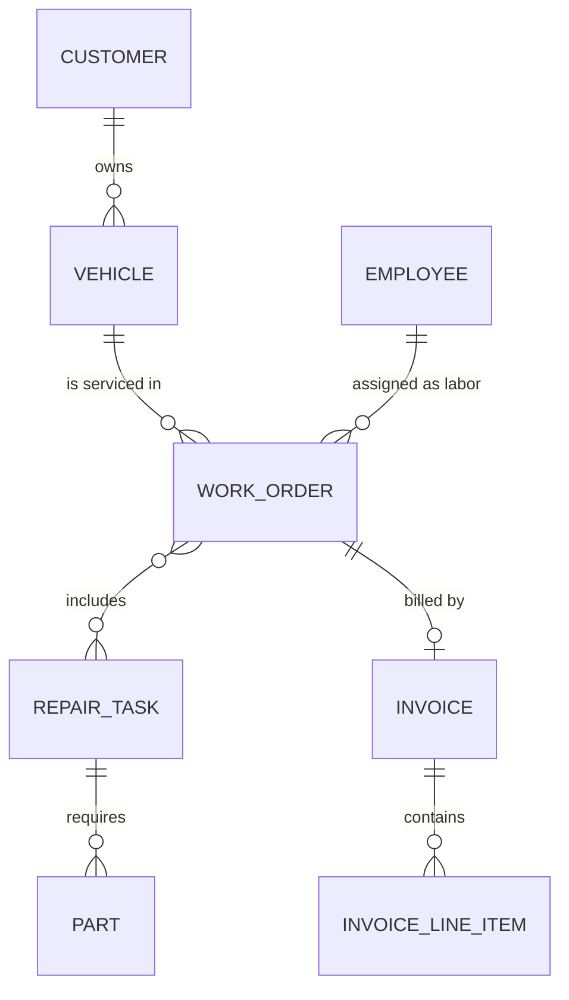
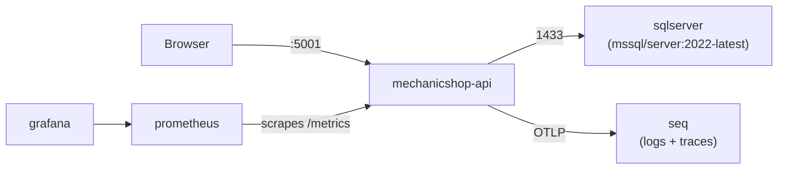

# MechanicShop

A workshop management system for scheduling repairs, assigning mechanics, and billing customers — built as a modular monolith on .NET 9 with a Blazor WebAssembly front end.

`.NET 9` · `ASP.NET Core` · `Blazor WebAssembly` · `EF Core 9` · `SQL Server` · `MediatR (CQRS)` · `FluentValidation` · `JWT + ASP.NET Core Identity` · `HybridCache` · `SignalR` · `Serilog + Seq` · `OpenTelemetry` · `Docker Compose` · `xUnit + Testcontainers`

MechanicShop models the day-to-day operation of a repair shop: booking a vehicle into one of a fixed number of bays, assigning a mechanic, tracking a work order through its lifecycle, and generating an invoice once the job is done. The backend is organized as a layered/Clean Architecture solution with CQRS via MediatR, and the UI is a Blazor WebAssembly app hosted from the same ASP.NET Core process and kept in sync in real time via SignalR.

---

## Project Snapshot

|                | |
| -------------- | --- |
| **Backend**        | ASP.NET Core 9 Web API, MediatR (CQRS), FluentValidation |
| **Frontend**       | Blazor WebAssembly, hosted by the API host (`AddInteractiveWebAssemblyComponents`) |
| **Database**       | SQL Server, EF Core 9 (code-first migrations) |
| **Architecture**   | Layered / Clean Architecture (Domain → Application → Infrastructure/Api), CQRS |
| **Authentication** | JWT bearer tokens + refresh tokens, ASP.NET Core Identity (`IdentityCore<AppUser>`) |
| **Authorization**  | Role-based (`Manager`, `Labor`) and resource-based (`LaborAssignedHandler`) policies |
| **Caching**        | `HybridCache` (in-process + backing cache) at the MediatR pipeline level, ASP.NET `OutputCache` |
| **Real-time**      | SignalR hub (`/hubs/workorders`) broadcasting schedule changes |
| **Testing**        | xUnit, NSubstitute, `WebApplicationFactory`, Testcontainers (SQL Server) |
| **Infrastructure** | Docker Compose (API, SQL Server, Seq, Prometheus, Grafana) |
| **Observability**  | Serilog (Console + Seq sinks), OpenTelemetry traces/metrics (OTLP + Prometheus exporters) |

---

## Why This Project?

MechanicShop isn't a CRUD demo — it's built around a scheduling problem with real constraints: a shop has a fixed number of bays, mechanics can't be double-booked, vehicles can't be in two places at once, and work orders move through a state machine that has to be enforced consistently no matter which endpoint touches it. The implementation addresses that directly:

- **Business rules live in the domain, not the controllers.** `WorkOrder`, `Customer`, `Invoice`, etc. are constructed through static `Create` factory methods that return a `Result<T>` instead of throwing, so invalid state is rejected at the model boundary.
- **Scheduling conflicts are checked explicitly.** `WorkOrderPolicy` (in Infrastructure) checks bay availability, mechanic availability, vehicle double-booking, operating hours, and minimum appointment duration before a work order is created or moved.
- **Separation of business logic from infrastructure.** The `Domain` project has no dependency on EF Core, ASP.NET Core, or any framework — it only depends on MediatR (for domain events).
- **Authorization beyond roles.** A mechanic can only transition the state of work orders assigned to them; this is enforced by a custom `IAuthorizationHandler`, not by an `if` statement in a controller.
- **Consistency at scale.** A HybridCache-backed MediatR pipeline behavior caches read-heavy queries, a background service auto-cancels bookings nobody showed up for, and SignalR pushes schedule changes to every connected client so the UI never shows stale data.
- **The system is observable.** Structured logs, distributed traces, and metrics are wired up from day one via Serilog/Seq and OpenTelemetry, not bolted on later.

---

## Features

### Business Features
- Customer and vehicle management (a customer owns 1..N vehicles)
- Work order lifecycle: `Scheduled → InProgress → Completed`, with `Cancelled` as a side transition
- Repair task catalog, each with a labor cost, an estimated duration, and a list of required parts
- Bay/spot scheduling across 4 fixed bays (`Spot.A`–`Spot.D`) with conflict detection
- Mechanic ("Labor") assignment and reassignment
- Invoicing: line items generated from a work order's tasks/parts, discount and tax support, PDF generation, payment recording
- Daily schedule view (per bay, per mechanic, timezone-aware)
- Dashboard statistics
- Automatic cancellation of overdue, unattended bookings (background service)

### Security
- JWT access + refresh token authentication
- ASP.NET Core Identity for user/role storage
- Role-based authorization (`Manager`, `Labor`)
- Resource-based ("self-scoped") authorization — a mechanic can only act on work orders assigned to them
- CORS restricted to configured origins

### API
- URL-segment API versioning (`api/v{version}/...`)
- Centralized request validation via FluentValidation + a MediatR validation pipeline behavior
- A domain `Result`/`Error` pattern mapped to RFC 7807 `ProblemDetails` (400/403/404/409/500)
- Pagination and filtering on list endpoints
- OpenAPI documents served via `Microsoft.AspNetCore.OpenApi`, browsable through both Swagger UI and Scalar
- Rate limiting (sliding window) and response caching (`OutputCache`)

### Engineering
- Clean/layered architecture with a dependency-inverted `Domain`
- CQRS via MediatR, with a custom pipeline: logging → validation → performance timing → unhandled-exception handling → caching
- Domain events dispatched from `SaveChangesAsync` (e.g. notifying customers when a work order completes, pushing schedule updates over SignalR)
- HybridCache-based query caching
- EF Core `SaveChangesInterceptor` for automatic audit stamping (`CreatedBy`/`CreatedAtUtc`/`LastModifiedBy`/`LastModifiedAtUtc`)
- Dockerized multi-container infrastructure (API, SQL Server, Seq, Prometheus, Grafana)
- Unit, "subcutaneous" (in-process, through MediatR), and full HTTP integration tests, the latter two backed by a real SQL Server via Testcontainers

---

## Tech Stack

| Layer | Technology | Version | Role |
| --- | --- | --- | --- |
| Runtime | .NET | 9.0 | Target framework for every project (`Directory.Build.props`) |
| Backend | ASP.NET Core | 9.0.10 | Web API host, MVC controllers, middleware pipeline |
| Backend | MediatR | 14.1.0 | In-process CQRS mediator + pipeline behaviors + domain event dispatch |
| Backend | Asp.Versioning.Mvc / .ApiExplorer | 8.1.0 | URL-segment API versioning |
| Validation | FluentValidation (+ DI extensions) | 12.1.1 | Request validation, invoked from a MediatR pipeline behavior |
| Frontend | Blazor WebAssembly | 9.0.10 | Interactive client UI, hosted from the API project |
| Frontend | Blazored.LocalStorage | 4.1.3 | Client-side token/session persistence |
| Real-time | SignalR (Server + `SignalR.Client`) | 9.0.10 | Live schedule/work-order updates to connected clients |
| Database | SQL Server | (container: `mssql/server:2022-latest`) | Primary relational store |
| Database | EF Core (SqlServer, Tools, Design) | 9.0.10 | ORM, code-first migrations, query translation |
| Authentication | ASP.NET Core Identity + JwtBearer | 9.0.10 | User/role storage, JWT issuing and validation |
| Caching | Microsoft.Extensions.Caching.Hybrid | 9.3.0 | `HybridCache` used inside the MediatR pipeline for cached queries |
| API documentation | Microsoft.AspNetCore.OpenApi, Swashbuckle, Scalar.AspNetCore | 9.0.10 / 9.0.6 / 2.6.7 | OpenAPI document generation, Swagger UI, Scalar UI |
| PDF generation | QuestPDF | 2026.7.2 | Invoice PDF rendering (Community license) |
| Logging | Serilog.AspNetCore, Serilog.Sinks.Seq | 10.0.0 / 9.1.0 | Structured logging to console and Seq |
| Observability | OpenTelemetry (Hosting, ASP.NET Core/HTTP instrumentation, OTLP + Prometheus exporters) | 1.17.0 / 1.13.1-beta.1 | Distributed tracing and metrics |
| Testing | xUnit, xunit.runner.visualstudio, coverlet.collector | 2.9.3 / 3.1.5 / 6.0.4 | Test framework, VS test runner, code coverage |
| Testing | NSubstitute | 6.2.0 | Mocking in unit tests |
| Testing | Microsoft.AspNetCore.Mvc.Testing | 9.0.10 | `WebApplicationFactory` for in-memory/HTTP test hosting |
| Testing | Testcontainers.MsSql | 4.8.1 | Real SQL Server instances for subcutaneous/integration tests |
| Containerization | Docker, Docker Compose | — | Multi-container local infrastructure |

---

## Architecture

The solution follows a Clean/layered Architecture split into five projects under `src/`, with a clear, one-directional dependency graph enforced by project references:



**Responsibilities:**

- **`Domain`** — The innermost layer. Contains entities (`WorkOrder`, `Customer`, `Vehicle`, `Employee`, `RepairTask`, `Part`, `Invoice`, `RefreshToken`), enums (`WorkOrderState`, `Spot`, `Role`), domain events, and a custom `Result<T>`/`Error` type used instead of exceptions for expected failures. Its only package dependency is MediatR, used purely for the `INotification` domain-event contract — there is no reference to EF Core or ASP.NET Core anywhere in this project.
- **`Application`** — Orchestrates use cases with MediatR commands/queries and their handlers, organized by feature (`WorkOrders`, `Customers`, `Billing`, `RepairTasks`, `Labors`, `Scheduling`, `Dashboard`, `Identity`). Defines the interfaces (`IAppDbContext`, `IUser`, `IWorkOrderPolicy`, `INotificationService`, etc.) that `Infrastructure` implements, and hosts the MediatR pipeline behaviors (logging, validation, performance, exception handling, caching). Depends only on `Domain`.
- **`Infrastructure`** — Implements the interfaces defined in `Application`: the EF Core `AppDbContext`, ASP.NET Core Identity setup, JWT issuing (`TokenProvider`), authorization policies/handlers, `HybridCache` registration, the SignalR notifier, the QuestPDF-based invoice generator, and the overdue-booking background service.
- **`Contracts`** — Plain HTTP request/response DTOs shared between the `Api` and the Blazor `Client`, with no dependency on any other project in the solution.
- **`Client`** — The Blazor WebAssembly front end (scheduling board, work order and customer management, billing screens, dashboard). Talks to the API over HTTP using `Contracts` DTOs and receives live updates over a SignalR hub connection.
- **`Api`** — The composition root. Wires up all the `AddX()` extension methods from `Application` and `Infrastructure`, exposes versioned REST controllers, hosts the Blazor `Client` as interactive WebAssembly components in the same process, and maps the SignalR hub.

---

## Request / Data Flow

A typical write request (e.g. creating a work order) flows through the stack like this:

```text
HTTP Request
     │
     ▼
Middleware pipeline (exception handling → status code pages → HTTPS redirect
                      → request logging → CORS → rate limiting
                      → authentication → authorization → output caching)
     │
     ▼
Controller (e.g. WorkOrdersController) — maps the request DTO to a MediatR command
     │
     ▼
MediatR pipeline behaviors:
   LoggingBehavior (pre-processor) → ValidationBehavior (FluentValidation)
   → PerformanceBehavior (timing) → UnhandledExceptionBehaviour
   → CachingBehavior (HybridCache, for ICachedQuery requests)
     │
     ▼
Command/Query Handler — orchestrates the use case
     │
     ▼
Domain logic — e.g. WorkOrder.Create(...) / WorkOrder.UpdateState(...),
               returning Result<T> instead of throwing
     │
     ▼
IWorkOrderPolicy (Infrastructure) — checks bay/mechanic/vehicle availability
     │
     ▼
IAppDbContext (EF Core) → AuditableEntityInterceptor stamps Created/Modified metadata
     │
     ▼
SQL Server — SaveChangesAsync, then queued domain events are dispatched via MediatR
     │
     ▼
Domain event handlers — e.g. notify customer by email/SMS on completion,
                         push "WorkOrdersChanged" over SignalR
     │
     ▼
Controller maps Result<T> to an HTTP response (2xx) or a ProblemDetails (4xx/5xx)
```

---

## Domain Model



**Verified relationships and rules:**

- A `Customer` has a required, non-empty collection of `Vehicle`s (`Customer.Create` rejects an empty list).
- A `WorkOrder` references a `VehicleId` and a `LaborId` (an `Employee`), has many `RepairTask`s (many-to-many, stored in a `WorkOrderRepairTasks` join table), and optionally has one `Invoice` (`Invoice.WorkOrderId` is the FK, restricted delete).
- A `RepairTask` owns a collection of `Part`s (cascade delete) and has a fixed `EstimatedDurationInMins` drawn from the `RepairDurationInMinutes` enum (15–180 minutes in 15-minute increments).
- `WorkOrder.State` follows a strict state machine enforced in `WorkOrder.CanTransitionTo`: `Scheduled → InProgress → Completed`, with `Cancelled` reachable from any non-`Completed` state.
- `WorkOrder` is only mutable (`IsEditable`) while it is `Scheduled` — once `InProgress`, `Completed`, or `Cancelled`, its timing, spot, labor, and repair tasks become read-only.
- `Employee.Role` is either `Labor` or `Manager` (`Role` enum), and this is the same role used for ASP.NET Core Identity role membership.
- Money-bearing entities (`WorkOrder.Tax`/`Discount`, `RepairTask.LaborCost`, `Invoice` amounts) are configured with `decimal(18,2)` precision.
- Several tables use non-clustered primary keys (`WorkOrder`, `Vehicle`, `RepairTask`) with supporting indexes on foreign keys and on `WorkOrder.State` / `(StartAtUtc, EndAtUtc)` to support scheduling queries.

---

## Key Engineering Decisions

**Result Pattern instead of exceptions for expected failures**
Domain factory methods (`WorkOrder.Create`, `Customer.Update`, etc.) and application-layer operations return `Result<T>` / `Result<Updated>` populated with a typed `Error` (`ErrorKind`: `Validation`, `Conflict`, `NotFound`, `Unauthorized`, `Forbidden`, `Failure`, `Unexpected`) rather than throwing. Controllers translate the error kind into the matching HTTP status and a `ProblemDetails` payload via a shared `Problem(List<Error>)` helper in the base `ApiController`. This provides the benefit of keeping expected business-rule violations out of the exception-handling path and makes error handling explicit and testable at every layer.

**CQRS via MediatR with a layered pipeline**
Commands and queries are routed through MediatR, with cross-cutting concerns implemented as pipeline behaviors instead of being duplicated in every handler: `LoggingBehavior` (request pre-processing), `ValidationBehavior` (FluentValidation), `PerformanceBehavior` (slow-request timing), `UnhandledExceptionBehaviour`, and `CachingBehavior`. This provides the benefit of keeping handlers focused purely on business orchestration.

**HybridCache-backed query caching, opt-in per query**
Read queries that implement `ICachedQuery` (e.g. `GetWorkOrdersQuery`, `GetDailyScheduleQuery`, `GetCustomersQuery`) are transparently cached by `CachingBehavior` using `HybridCache`, with per-query cache keys, tags, and expirations. This provides the benefit of reducing repeated database round-trips for frequently polled read endpoints (like the daily schedule) without scattering caching logic through the handlers themselves.

**Resource-based ("self-scoped") authorization**
Beyond role checks (`ManagerOnly`), the `state` transition endpoint additionally requires the `SelfScopedWorkOrderAccess` policy, enforced by `LaborAssignedHandler`, which checks that the authenticated user's ID matches the `LaborId` on the target work order (or that the user is a `Manager`). This provides the benefit of restricting mechanics to only the work orders assigned to them, at the framework's authorization layer rather than inside handler code.

**Domain events dispatched from `SaveChangesAsync`**
`AppDbContext` collects `DomainEvents` recorded on tracked `Entity` instances and publishes them through MediatR immediately after the underlying `SaveChangesAsync` call. `WorkOrderCompleted` triggers a customer notification (email/SMS), and `WorkOrderCollectionModified` triggers a SignalR broadcast so every connected client's schedule view refreshes. This provides the benefit of keeping side effects decoupled from the command handler that caused them.

**EF Core `SaveChangesInterceptor` for auditing**
`AuditableEntityInterceptor` automatically stamps `CreatedBy`/`CreatedAtUtc`/`LastModifiedBy`/`LastModifiedAtUtc` on every `AuditableEntity` (including owned entities) on `Added`/`Modified` state, using an injected `IUser` and `TimeProvider`. This provides the benefit of guaranteeing consistent audit metadata without handlers having to set it manually.

**`TimeProvider` abstraction instead of `DateTime.UtcNow`**
Time-sensitive logic (audit stamps, the overdue-booking cleanup job) reads from an injected `TimeProvider` rather than calling the static clock directly. This provides the benefit of deterministic, fake-clock-driven unit tests (`FakeTimeProvider` in `MechanicShop.Tests.Common`).

**Background service for schedule hygiene**
`OverdueBookingCleanupService` runs on a `PeriodicTimer` and automatically cancels `Scheduled` work orders whose start time has passed a configurable grace period (`BookingCancellationThresholdMinutes`). This provides the benefit of keeping the bay schedule accurate without requiring manual cleanup.

---

## Security

- **Authentication** is JWT-bearer based. `IdentityController` exchanges credentials for an access/refresh token pair (`token/generate`) and can refresh an expired access token against a stored `RefreshToken` (`token/refresh-token`).
- **User storage** uses `AddIdentityCore<AppUser>` with `AddRoles<IdentityRole>()` and EF Core as the store; passwords are configured with a reduced complexity policy suitable for this demo domain (`RequiredLength = 6`, no digit/uppercase/special-character requirement) — tune this before any production use.
- **Token validation** (`AddJwtBearer`) validates issuer, audience, lifetime, and signing key, with the signing key read from configuration (`JwtSettings:Secret`) rather than hardcoded.
- **Authorization** combines:
  - Role checks — `[Authorize(Policy = "ManagerOnly")]` requires the `Manager` role.
  - A custom resource-based policy (`SelfScopedWorkOrderAccess`) — a `Labor` user may only act on work orders they are assigned to; a `Manager` can act on any.
- **CORS** is restricted to an explicit allow-list read from `AppSettings:AllowedOrigins`, with credentials support enabled for the SignalR/cookie-adjacent flows.
- **Rate limiting** is applied globally via a sliding-window limiter (100 requests/minute, 6 segments, queueing enabled) before authentication runs, to protect auth endpoints from abuse.
- **HTTPS/HSTS** — `UseHsts()` is enabled outside Development; `UseHttpsRedirection()` runs early in the pipeline.
- **Secrets** — the JWT signing key, SQL `sa` password, and Grafana admin password are supplied via environment variables (`.env` for Docker Compose, User Secrets for local development) and are **not** committed with real values.

> **Never commit secrets, credentials, JWT signing keys, API keys, or production connection strings to source control.** The repository's `.env` file (used only for local Docker Compose) is listed in `.gitignore`.

---

## Caching & Performance

- **`HybridCache`** is registered with a default entry policy of a 10-minute distributed expiration and a 30-second local (in-process) expiration, and is consumed exclusively through the `CachingBehavior` MediatR pipeline behavior for any request implementing `ICachedQuery` (work orders, customers, repair tasks, labors, daily schedule, invoices).
- **`OutputCache`** middleware is configured at the ASP.NET Core level (100 MB size limit) and runs after authentication/authorization so cache entries can respect the caller's identity.
- **Pagination** is enforced on list endpoints (e.g. `GetWorkOrders`) via a `PageRequest`, with the controller validating `Page > 0` and `1 ≤ PageSize ≤ 100` before the query is dispatched.
- **Filtering** is supported on work order queries (state, vehicle, labor, spot, date ranges, search term) so large result sets aren't pulled back just to be filtered client-side.
- **Async everywhere** — all database access goes through async EF Core APIs (`AnyAsync`, `ToListAsync`, `FirstOrDefaultAsync`) with `CancellationToken` propagated from the HTTP request down through MediatR to the database call.
- **Indexes** exist on the columns the scheduling and filtering queries actually use (`WorkOrder.LaborId`, `WorkOrder.VehicleId`, `WorkOrder.State`, `(StartAtUtc, EndAtUtc)`), rather than being added speculatively.

No load-test results or benchmark numbers are published for this project.

---

## Observability

- **Structured logging** via Serilog, configured entirely from `appsettings.json` (`ReadFrom.Configuration`). Sinks: Console and Seq. Enrichers: `FromLogContext`, `WithMachineName`, `WithThreadId`. A custom `RequestLogContextMiddleware` pushes the ASP.NET Core `TraceIdentifier` into the log context as `CorrelationId` for every request.
- **Request logging** uses `UseSerilogRequestLogging()` for a structured, single-line summary of every HTTP request.
- **Tracing and metrics** are configured through OpenTelemetry (`AddAppOpenTelememrty`): ASP.NET Core and `HttpClient` instrumentation feed both a tracing pipeline (OTLP exporter) and a metrics pipeline (OTLP + Prometheus exporters, the latter exposing a local `/metrics` endpoint).
- **Local inspection**:
  - Logs — Seq UI, when running under Docker Compose.
  - Metrics — Prometheus (scrapes the API's `/metrics` endpoint) and Grafana, both provisioned as Compose services.

---

## API

- **Versioning** — URL-segment versioning (`api/v{version:apiVersion}/...`), with `Asp.Versioning.Mvc` reporting supported versions and defaulting to `1.0` when unspecified. `IdentityController` and `SettingsController` are version-neutral.
- **Documentation** — `Microsoft.AspNetCore.OpenApi` generates the OpenAPI document (with custom document/operation transformers for version info and the bearer security scheme); it is exposed through both **Swagger UI** and **Scalar** in Development.
- **Validation** — FluentValidation validators run inside the MediatR `ValidationBehavior`; failures short-circuit into an `Error.Validation` result and surface as a `ValidationProblemDetails` (400) response.
- **Error shape** — All error responses use RFC 7807 `ProblemDetails`, enriched with a `requestId` extension and a normalized `Instance` (`"{METHOD} {PATH}"`).
- **Pagination/filtering** — see [Caching & Performance](#caching--performance).

### Endpoint Overview

| Resource | Method | Route | Purpose | Authorization |
| --- | --- | --- | --- | --- |
| Identity | POST | `/identity/token/generate` | Exchange credentials for an access/refresh token pair | Anonymous |
| Identity | POST | `/identity/token/refresh-token` | Exchange a refresh token for a new token pair | Anonymous |
| Identity | GET | `/identity/current-user/claims` | Get the current authenticated user's info | Authenticated |
| Work Orders | GET | `/api/v1/workorders` | Paginated, filterable list of work orders | Authenticated |
| Work Orders | GET | `/api/v1/workorders/{id}` | Get a single work order | Authenticated |
| Work Orders | POST | `/api/v1/workorders` | Create a work order | Manager |
| Work Orders | PUT | `/api/v1/workorders/{id}/relocation` | Reschedule (time + bay) | Manager |
| Work Orders | PUT | `/api/v1/workorders/{id}/labor` | Reassign the mechanic | Manager |
| Work Orders | PUT | `/api/v1/workorders/{id}/state` | Transition work order state | Manager, or assigned Labor |
| Work Orders | PUT | `/api/v1/workorders/{id}/repair-task` | Replace the repair task list | Manager |
| Work Orders | DELETE | `/api/v1/workorders/{id}` | Delete a work order | Manager |
| Work Orders | GET | `/api/v1/workorders/schedule` | Daily schedule (requires `X-TimeZone` header) | Authenticated |
| Customers | GET/POST/PUT/DELETE | `/api/v1/customers[/{id}]` | Customer CRUD | Authenticated (write ops: Manager) |
| Repair Tasks | GET/POST/PUT/DELETE | `/api/v1/repair-tasks[/{id}]` | Repair task catalog CRUD | Authenticated (write ops: Manager) |
| Labors | GET | `/api/v1/labors` | List mechanics | Authenticated |
| Invoices | POST | `/api/v1/invoices/workorders/{workOrderId}` | Generate an invoice for a completed work order | Manager |
| Invoices | GET | `/api/v1/invoices/{id}` | Get invoice details | Manager |
| Invoices | GET | `/api/v1/invoices/{id}/pdf` | Download the invoice as a PDF | Manager |
| Invoices | PUT | `/api/v1/invoices/{id}/payments` | Record a payment | Manager |
| Dashboard | GET | `/api/v1/dashboard/stats` | Aggregate dashboard statistics | Authenticated |
| Settings | GET | `/api/settings/operating-hours` | Public shop operating hours | Anonymous |

---

## Authorization Model

```text
Manager
   │
   ├── Full CRUD on customers, vehicles, repair tasks
   ├── Create, reschedule, reassign, delete work orders
   ├── Manage invoices and payments
   └── Change the state of ANY work order

Labor (mechanic)
   │
   └── Change the state of work orders where WorkOrder.LaborId == current user's Id
       (enforced by the "SelfScopedWorkOrderAccess" policy / LaborAssignedHandler)

Authenticated (any role)
   │
   └── Read access: work orders, schedule, customers, repair tasks, labors, dashboard
```

---

## Testing

The solution separates tests by scope into four projects, plus a shared test-support library:

| Project | Scope | Key tools |
| --- | --- | --- |
| `MechanicShop.Domain.UnitTests` | Pure domain logic (`WorkOrder`, `Customer`, `Employee`, `Invoice`, `Part`, `RefreshToken`) | xUnit |
| `MechanicShop.Application.UnitTests` | MediatR pipeline behaviors and mappers, in isolation | xUnit, NSubstitute |
| `MechanicShop.Application.SubcutaneousTests` | Full feature slices exercised through MediatR (in-process, no HTTP), against a real SQL Server | xUnit, `WebApplicationFactory`, Testcontainers.MsSql |
| `MechanicShop.Api.IntegrationTests` | End-to-end HTTP tests against the API surface | xUnit, `WebApplicationFactory`, Testcontainers.MsSql |
| `MechanicShop.Tests.Common` | Shared test data factories (`WorkOrderFactory`, `CustomerFactory`, etc.), `FakeTimeProvider`, auth test helpers | xUnit, NSubstitute |

This layering exists so that fast, dependency-free domain/unit tests can run on every save, while the subcutaneous and integration suites — which spin up a real, disposable SQL Server container via Testcontainers and reset the `WorkOrders` table between runs — validate the system the way it actually behaves against its real database engine.

**Running the tests:**

```bash
dotnet test
```

> The `MechanicShop.Application.SubcutaneousTests` and `MechanicShop.Api.IntegrationTests` projects use Testcontainers to start a disposable SQL Server container, so **Docker must be running** for the full test suite to pass. `MechanicShop.Domain.UnitTests` and `MechanicShop.Application.UnitTests` have no such requirement.

To run only the tests that don't need Docker:

```bash
dotnet test tests/MechanicShop.Domain.UnitTests
dotnet test tests/MechanicShop.Application.UnitTests
```

---

## Database

- **Engine**: SQL Server (`Microsoft.EntityFrameworkCore.SqlServer`).
- **Schema management**: EF Core code-first migrations, currently a single consolidated `Initial` migration (`src/MechanicShop.Infrastructure/Data/Migrations`).
- **Identity tables** are part of the same `AppDbContext` (it derives from `IdentityDbContext<AppUser>`), so users, roles, and domain tables live in one database.
- **Auditing**: every `AuditableEntity` gets `CreatedBy`/`CreatedAtUtc`/`LastModifiedBy`/`LastModifiedAtUtc` populated automatically by `AuditableEntityInterceptor`, including for owned sub-entities.
- **Precision**: monetary `decimal` columns are explicitly configured with `HasPrecision(18, 2)`.
- **Development seed data**: `ApplicationDbContextInitialiser` (invoked only when `app.Environment.IsDevelopment()`) seeds the `Manager`/`Labor` roles, five demo users (one manager, four mechanics), sample customers/vehicles, a repair-task catalog, and a month's worth of procedurally generated work orders (plus two "live" orders — one just started, one about to finish) so the schedule view has realistic data to show immediately after startup. Demo account emails are visible in `ApplicationDbContextInitialiser.cs`; passwords are not reproduced here.

**Applying migrations manually** (from the repository root):

```bash
dotnet ef database update \
  --project src/MechanicShop.Infrastructure \
  --startup-project src/MechanicShop.Api
```

In practice this isn't usually necessary — the API applies pending migrations (and seeds demo data) automatically on startup when running in the `Development` environment.

---

## Docker Architecture

`docker-compose.yml` defines five services:



| Service | Image | Ports | Purpose |
| --- | --- | --- | --- |
| `mechanicshop-api` | built from the repo `Dockerfile` | `5001:80` | The ASP.NET Core host (API + Blazor client + SignalR hub) |
| `sqlserver` | `mcr.microsoft.com/mssql/server:2022-latest` | `1433:1433` | Primary database, with a named volume (`sqlserver-data`) for persistence |
| `seq` | `datalust/seq:latest` | `5341:5341`, `8081:80` | Structured log storage/viewer, receiving Serilog output and OTLP traces |
| `prometheus` | `prom/prometheus:latest` | `9090:9090` | Metrics scraping |
| `grafana` | `grafana/grafana:latest` | `3000:3000` | Metrics dashboards, with a named volume (`grafana-data`) for persistence |

The Dockerfile is a two-stage build: `dotnet publish` under the `sdk:9.0` image, copied into a slim `aspnet:9.0` final image with timezone data installed (`America/Montreal`, used by the daily-schedule feature).

> The `sqlserver` container is a separate SQL Server instance from any locally installed SQL Server you might use for `dotnet run`. The connection string in `appsettings.json` (`Server = .`) targets a local instance; the Docker Compose environment overrides it to point at the `sqlserver` container instead.

---

## Local Setup

1. **Clone the repository**
   ```bash
   git clone <repository-url>
   cd MechanicShop
   ```
2. **Install prerequisites**
   - [.NET 9 SDK](https://dotnet.microsoft.com/download)
   - A local or containerized SQL Server instance
   - (Optional) Docker Desktop, if you'd rather run everything via Compose or need it for tests
3. **Configure secrets** — set the JWT signing key via User Secrets for the `MechanicShop.Api` project (the `UserSecretsId` is already set in its `.csproj`):
   ```bash
   cd src/MechanicShop.Api
   dotnet user-secrets set "JwtSettings:Secret" "<a-long-random-string>"
   ```
   Adjust `ConnectionStrings:DefaultConnection` in `appsettings.json` (or via User Secrets) if your SQL Server instance isn't the local default instance the connection string assumes.
4. **Start SQL Server** — ensure the instance referenced by your connection string is running and reachable.
5. **Apply migrations & seed data** — not a separate step: running the API in `Development` calls `InitialiseDatabaseAsync()`, which migrates and seeds automatically. To do it manually instead, see [Database](#database).
6. **Run the application**
   ```bash
   dotnet run --project src/MechanicShop.Api
   ```
   The API defaults to `http://localhost:5001` (and `https://localhost:7007` under the `https` launch profile), and serves both the REST API and the Blazor client from the same process.
7. **Run tests**
   ```bash
   dotnet test
   ```
   (Requires Docker running for the subcutaneous/integration suites — see [Testing](#testing).)

---

## Docker Setup

**Prerequisites**: Docker and Docker Compose. Create a `.env` file in the repository root (same directory as `docker-compose.yml`) defining:

```text
SA_PASSWORD=<a-strong-sql-server-password>
JWT_SECRET=<a-long-random-string>
GRAFANA_ADMIN_PASSWORD=<a-strong-password>
```

**Build and start everything:**

```bash
docker compose up -d --build
```

**View logs for a specific service:**

```bash
docker compose logs -f mechanicshop-api
```

**Stop the stack (keeps data):**

```bash
docker compose down
```

**Stop the stack and remove volumes** (this deletes the SQL Server and Grafana data volumes — use with care):

```bash
docker compose down -v
```

---

## Configuration

| Setting | Purpose | Sensitive |
| --- | --- | --- |
| `ConnectionStrings:DefaultConnection` | SQL Server connection string | Yes |
| `JwtSettings:Secret` | JWT signing key | Yes |
| `JwtSettings:Issuer` / `Audience` | JWT validation parameters | No |
| `JwtSettings:TokenExpirationInMinutes` | Access token lifetime | No |
| `AppSettings:CorsPolicyName` / `AllowedOrigins` | Allowed CORS origins | No |
| `AppSettings:OpeningTime` / `ClosingTime` | Shop operating hours | No |
| `AppSettings:MaxSpots` | Number of physical bays | No |
| `AppSettings:MinimumAppointmentDurationInMinutes` | Minimum work order duration | No |
| `AppSettings:LocalCacheExpirationInMins` / `DistributedCacheExpirationMins` | Cache lifetimes | No |
| `AppSettings:DefaultPageNumber` / `DefaultPageSize` | List endpoint pagination defaults | No |
| `AppSettings:BookingCancellationThresholdMinutes` | Grace period before an unattended booking is auto-cancelled | No |
| `AppSettings:OverdueBookingCleanupFrequencyMinutes` | How often the cleanup background service runs | No |
| `Serilog:*` | Logging sinks, levels, enrichers | No |
| `OTEL_EXPORTER_OTLP_ENDPOINT` / `OTEL_EXPORTER_OTLP_PROTOCOL` | OpenTelemetry exporter target (Docker Compose env vars) | No |
| `SA_PASSWORD` / `GRAFANA_ADMIN_PASSWORD` (Compose `.env`) | Container admin credentials | Yes |

No secret values are reproduced in this document.

---

## Application URLs

| Environment | Service | URL | Description |
| --- | --- | --- | --- |
| Local (`dotnet run`, `http` profile) | Application/API | `http://localhost:5001` | API + hosted Blazor client |
| Local (`dotnet run`, `https` profile) | Application/API | `https://localhost:7007` (and `http://localhost:5001`) | API + hosted Blazor client |
| Local (Development) | Swagger UI | `/swagger` (relative to the above) | API documentation |
| Local (Development) | Scalar | mapped via `MapScalarApiReference()` (relative to the above) | API documentation |
| Docker Compose | Application/API | `http://localhost:5001` | API + hosted Blazor client |
| Docker Compose | SQL Server | `localhost:1433` | Database (container) |
| Docker Compose | Seq | `http://localhost:8081` (UI), `5341` (ingestion) | Structured logs / traces |
| Docker Compose | Prometheus | `http://localhost:9090` | Metrics |
| Docker Compose | Grafana | `http://localhost:3000` | Dashboards |

---

## Troubleshooting

- **`ArgumentNullException` on startup mentioning the connection string** — `AddInfrastructure` throws if `ConnectionStrings:DefaultConnection` is missing; check `appsettings.json`/User Secrets/environment variables depending on how you're running the app.
- **JWT-related failures on login** — `JwtSettings:Secret` isn't set in `appsettings.json` by design; it must come from User Secrets (local) or the `JWT_SECRET` environment variable (Docker Compose).
- **Tests hang or fail with a container-related error** — the subcutaneous and integration test projects use Testcontainers.MsSql, which requires a running Docker daemon; make sure Docker Desktop (or an equivalent) is running before `dotnet test`.
- **Docker container SQL Server vs. local SQL Server** — the default `appsettings.json` connection string (`Server = .`) targets a local SQL Server instance, not the `sqlserver` container. When running via Docker Compose, the connection string is overridden by the `ConnectionStrings__DefaultConnection` environment variable in `docker-compose.yml`. Mixing the two up will make it look like your data "disappeared."
- **Port conflicts on `5001`, `1433`, `5341`, `9090`, or `3000`** — another process (or a previous `docker compose` run) may already be bound to one of these; stop the conflicting process or adjust the port mapping in `docker-compose.yml`.
- **CORS errors from the Blazor client** — check that the origin you're calling from is listed in `AppSettings:AllowedOrigins`.
- **Missing `X-TimeZone` header on the schedule endpoint** — `GET /api/v1/workorders/schedule` returns a 400 `ProblemDetails` if the `X-TimeZone` header is absent or not a recognized IANA/Windows timezone ID.

---

## Development Workflow

```text
Clone
 │
 ▼
Configure secrets (JwtSettings:Secret via User Secrets, or .env for Docker)
 │
 ▼
Start SQL Server (local instance or Docker container)
 │
 ▼
Run the API (migrations + seed data applied automatically in Development)
 │
 ▼
Develop — implement a feature end-to-end: Domain → Application (command/query
          + handler + validator) → Infrastructure (if a new dependency is
          needed) → Api (controller) → Client (Blazor UI), if applicable
 │
 ▼
Run tests (dotnet test — Docker required for subcutaneous/integration suites)
 │
 ▼
Repeat
```

---

## Project Structure

```text
MechanicShop/
├── src/
│   ├── MechanicShop.Api/            # Composition root: controllers, DI wiring, hosts the Blazor client
│   ├── MechanicShop.Application/    # CQRS commands/queries/handlers, validators, pipeline behaviors
│   ├── MechanicShop.Client/         # Blazor WebAssembly UI
│   ├── MechanicShop.Contracts/      # Shared HTTP request/response DTOs
│   ├── MechanicShop.Domain/         # Entities, domain events, Result/Error types — framework-free
│   └── MechanicShop.Infrastructure/ # EF Core, Identity, JWT, caching, SignalR, background jobs
│
├── tests/
│   ├── MechanicShop.Tests.Common/               # Shared test factories, FakeTimeProvider, auth helpers
│   ├── MechanicShop.Domain.UnitTests/           # Domain entity unit tests
│   ├── MechanicShop.Application.UnitTests/      # Pipeline behavior and mapper unit tests
│   ├── MechanicShop.Application.SubcutaneousTests/ # Feature tests through MediatR, real SQL Server
│   └── MechanicShop.Api.IntegrationTests/       # End-to-end HTTP tests, real SQL Server
│
├── containers/                      # Bind-mounted config/data for Seq and Prometheus
├── requests/requests.http           # Sample HTTP requests for manual API exploration
├── Directory.Build.props            # Shared MSBuild settings (TargetFramework, Nullable, etc.)
├── Directory.Packages.props         # Centrally managed NuGet package versions
├── Dockerfile
├── docker-compose.yml
└── MechanicShop.sln
```

---

## Design Patterns

| Pattern | Where | Purpose in this project |
| --- | --- | --- |
| **Layered / Clean Architecture** | Solution-wide project structure | Keeps `Domain` framework-free and dependency-inverted; outer layers depend inward, never the reverse |
| **CQRS + Mediator** | `Application` (MediatR commands/queries/handlers) | Separates read and write use cases and decouples controllers from handler implementations |
| **Result Pattern** | `Domain.Common.Results` (`Result<T>`, `Error`, `ErrorKind`) | Represents expected failures as values instead of exceptions, flowing uniformly from domain to HTTP response |
| **Pipeline / Decorator (MediatR behaviors)** | `LoggingBehavior`, `ValidationBehavior`, `PerformanceBehavior`, `UnhandledExceptionBehaviour`, `CachingBehavior` | Applies cross-cutting concerns to every command/query without modifying handlers |
| **Options Pattern** | `AppSettings` bound via `IOptions<AppSettings>` | Strongly-typed, centrally validated access to shop/scheduling configuration |
| **Interceptor** | `AuditableEntityInterceptor` (`SaveChangesInterceptor`) | Automatically stamps audit metadata on every save, independent of the entity being saved |
| **Factory methods (static `Create`)** | Domain entities (`WorkOrder.Create`, `Customer.Create`, etc.) | Enforces invariants at construction time and returns `Result<T>` on violation, instead of exposing public constructors |
| **Policy object** | `IWorkOrderPolicy` / `WorkOrderPolicy` | Centralizes scheduling-conflict rules (bay, mechanic, vehicle, hours, minimum duration) outside the domain entity itself |
| **Resource-based authorization handler** | `LaborAssignedHandler` / `LaborAssignedRequirement` | Encapsulates the "assigned mechanic" access rule as a reusable ASP.NET Core authorization requirement |
| **Domain events** | `WorkOrderCompleted`, `WorkOrderCollectionModified` + their `INotificationHandler`s | Decouples side effects (notifications, SignalR broadcasts) from the command that triggers them |

---

## SOLID & Code Quality

- **Single Responsibility** is visible at the MediatR handler level — each command/query handler does one thing, and cross-cutting concerns (logging, validation, caching, timing) are factored out into pipeline behaviors rather than duplicated inside handlers.
- **Dependency Inversion** is enforced structurally: `Application` defines interfaces (`IAppDbContext`, `IWorkOrderPolicy`, `IUser`, `INotificationService`, `IWorkOrderNotifier`, `ITokenProvider`, `IInvoicePdfGenerator`) that `Infrastructure` implements, so the inner layers never reference the outer ones.
- **Open/Closed** is supported by the MediatR pipeline — new cross-cutting behavior can be added as a new `IPipelineBehavior` without touching existing handlers, and new cached queries opt in simply by implementing `ICachedQuery`.
- **Encapsulation** is enforced in the domain entities — all mutation happens through named methods (`UpdateState`, `UpdateTiming`, `AddRepairTask`, …) that validate invariants, backing fields are private, and collections are exposed as read-only.
- **Testability** is a direct consequence of the above: the `Domain` project has no external dependencies to mock, `Application` handlers depend only on interfaces (mockable with NSubstitute), and the `TimeProvider` abstraction removes the need to control the system clock via reflection or sleeps in tests.

No claim is made that the codebase is "fully SOLID" or "100% clean" — these are patterns visibly and consistently applied, not an audited guarantee.

---

## Contributing

1. Create a feature branch from `main`.
2. Implement the change, following the existing project layout (Domain → Application → Infrastructure/Api → Client, as applicable).
3. Add or update tests at the appropriate level (`Domain.UnitTests` for pure domain logic, `Application.UnitTests` for behaviors/mappers, `Application.SubcutaneousTests`/`Api.IntegrationTests` for end-to-end feature coverage).
4. Run `dotnet test` locally (with Docker running) before opening a pull request.
5. Open a pull request describing the change and the reasoning behind it.

---

## License

No license has been specified in the repository.

---

## Screenshots

Screenshots will be added soon.

---

## Engineering Highlights

- Layered/Clean Architecture with a genuinely framework-free `Domain` project
- CQRS via MediatR with a five-stage cross-cutting pipeline (logging, validation, performance, exception handling, caching)
- A domain-level `Result`/`Error` pattern mapped consistently to RFC 7807 `ProblemDetails`
- JWT authentication with refresh tokens, layered with both role-based and resource-based (self-scoped) authorization
- `HybridCache`-backed query caching wired transparently into the MediatR pipeline
- Domain events driving real-time SignalR updates and customer notifications
- A background hosted service enforcing schedule hygiene (auto-cancelling overdue bookings)
- Structured logging (Serilog/Seq) and OpenTelemetry tracing/metrics (OTLP + Prometheus) from day one
- A five-container Docker Compose stack (API, SQL Server, Seq, Prometheus, Grafana)
- Tests split by scope — unit, subcutaneous, and full HTTP integration — with the latter two run against a real, disposable SQL Server via Testcontainers